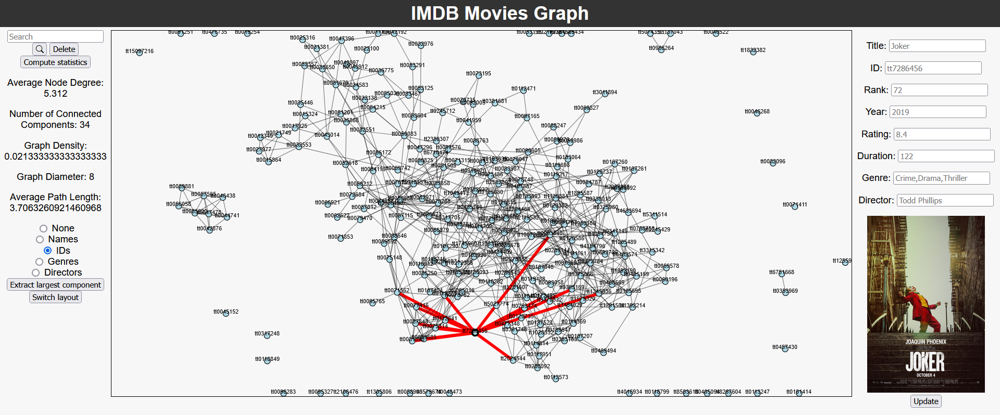
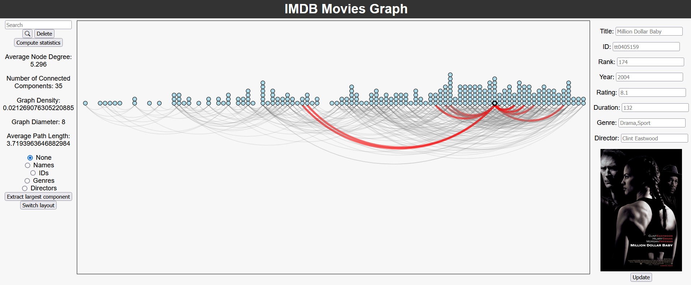

# Force Directed Graph of IMdB's Top 250 Movies

This is a web application that uses d3.js to produce an interactive force directed graph where two movies will be connected if they share an actor/actress.

Details about the graph as a whole is displayed on the left, and shows various attributes about the graph. Node labels can be changed or toggled on and off using the radio buttons.

Specific nodes can be searched for by thier name, rank, id, or director. If the node is found within the graph, it will be enlarged and all other nodes made smaller and translucent.

A user can also manually connect two nodes together by clicking and dragging a line from one movie node to the other.

The right panel shows information about a node that is moused-over. If the data is incorrect, a user can manually update it by typing in the text field, and clicking the "Update" button

### Alternate view

There is also an alternate view available which uses a chord diagram

